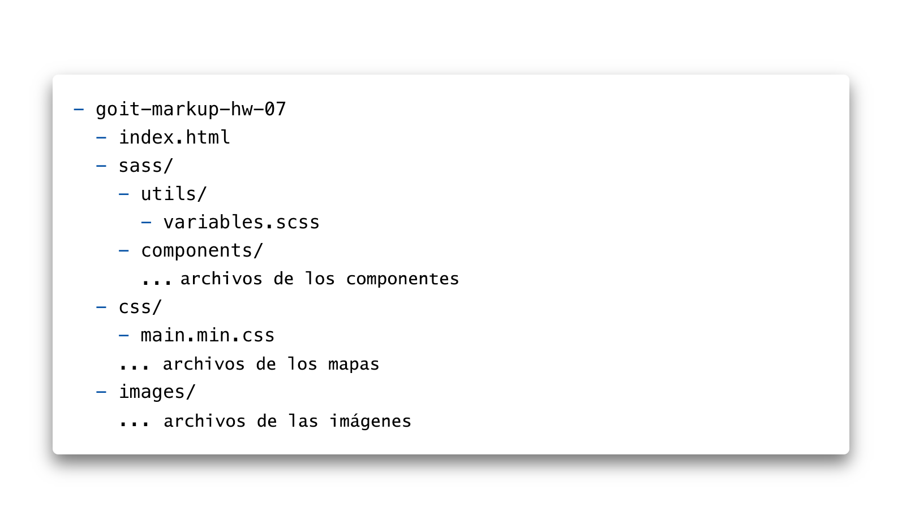

<h1 id="home">Homework :clipboard:</h1>

## goit-markup-hw-07

* 🇺🇸 [English](#en)
* 🇺🇦 [Ukrainian](#uk)
* 🇷🇺 [Russian](#ru)

--- 

<h3 id="en">📚 EN 📚</h3>

<ul>
		<li>Create a repository `goit-markup-hw-07`.</li>
		<li>Clone the created repository and copy the files of the previous work into it.</li>
		<li>Set up `GitHub Pages` and add a link to the live page in the header of the GitHub-repository.</li>
	</ul>

 ## Project file structure

## Eligibility criteria for a mentor

### Project

**`«A1»`** The project's HTML code was refactored using the BEM methodology.

**`«A2»`** The CSS code of the project has been refactored using the `SASS` preprocessor.

**`«A3»`** The `sass` folder is created in the root of the project, in which all the preprocessor style files are located.

**`«A4»`** The `sass` folder contains the `main.scss` file - the main file into which all SASS fragments (partials, `_name.scss` files) are imported.

**`«A5»`** The layout color palette and font sets are placed in variables in the `variables.scss` file, which is located in the `sass/utils` folder. You can use CSS or SASS variables (optional).

**`«A6»`** For each component, a separate styles fragment file has been created in the `sass/components` folder. For example `_page-header.scss`, `_logo.scss` etc.

**`«A7»`** The `index.html` and `portfolio.html` files include the minified style file `main.min.css` from the `css` folder.

### Markup

**`«B1»`** Correct naming of block classes according to BEM methodology.

**`«B2»`** Correct naming of element classes according to BEM methodology.

**`«B3»`** Correct naming of modifier classes according to BEM methodology.

**`«B4»`** Correct naming of impurity classes according to BEM methodology.

**`«B5»`** Class names according to the BEM methodology are clear and descriptive, in English.

## Formalization

**`«C1»`** Selector nesting is used.

**`«C2»`** The maximum nesting of selectors is 2 levels.

**`«C3»`** The concatenation operator (`&`) is used to describe pseudo-classes and pseudo-elements.

---
---

<h3 id="uk">📚 UK 📚 <a href="#home">⬆ Home ⬆</a></h3> 			

<ul>
  <li>Створи репозиторій `goit-markup-hw-07`.</li>
  <li>Схиляй створений репозиторій та скопіюй у нього файли попередньої роботи.</li>
  <li>Налаштуйте `GitHub Pages` та додай посилання на живу сторінку в шапку GitHub-репозиторія.</li>
  </ul>

## Структура файлів проекту

## Критерії прийому роботи наставником

### Проект

**`«A1»`** Виконано рефакторинг HTML-коду проекту використовуючи методологію BEM.

**`«A2»`** Виконано рефакторинг CSS-коду проекту використовуючи препроцесор `SASS`.

**`«A3»`** У корені проекту створена папка `sass`, в якій лежать усі файли стилів препроцесора.

**`«A4»`** У папці `sass` є файл `main.scss` - головний файл у який імпортуються всі SASS-фрагменти (partials, файли `_ім'я.scss`).

**`«A5»`** Палітра кольорів макету та набори шрифтів винесені у змінні у файлі `variables.scss`, який лежить у папці `sass/utils`. Можна використовувати CSS або SASS змінні (за бажанням).

**`«A6»`** Для кожного компонента створено окремий файл-фрагмент стилів у папці `sass/components`. Наприклад `_page-header.scss`, `_logo.scss` і т.д.

**`«A7»`** У файлах `index.html` і `portfolio.html` підключений мініфікований файл стилів `main.min.css` з папки `css`.

### Розмітка

**`«B1»`** Правильне найменування класів блоків за методологією BEM.

**`«B2»`** Правильне найменування класів елементів за методологією BEM.

**`«B3»`** Правильне найменування класів модифікаторів з методології BEM.

**`«B4»`** Правильне найменування класів домішок за методологією BEM.

**`«B5»`** Імена класів з методології BEM зрозумілі та описові, англійською мовою.

## Оформлення

**`«C1»`** Використана вкладеність селекторів.

**`«C2»`** Максимальна вкладеність селекторів - 2 рівні.

**`«C3»`** Оператор конкатенації (`&`) використаний для опису псевдокласів та псевдоелементів.

---
---

<h3 id="ru">📚 RU 📚 <a href="#home">⬆ Home ⬆</a></h3> 

<ul>
		<li>Создай репозиторий `goit-markup-hw-07`.</li>
		<li>Склонируй созданный репозиторий и скопируй в него файлы предыдущей работы.</li>
		<li>Настрой `GitHub Pages` и добавь ссылку на живую страницу в шапку GitHub-репозитория.</li>
	</ul>

## Структура файлов проекта

## Критерии приёма работы наставником

### Проект

**`«A1»`** Выполнен рефакторинг HTML-кода проекта используя методологию BEM.

**`«A2»`** Выполнен рефакторинг CSS-кода проекта используя препроцессор `SASS`.

**`«A3»`** В корне проекта создана папка `sass`, в которой лежат все файлы стилей препроцессора.

**`«A4»`** В папке `sass` есть файл `main.scss` - главный файл в котрый импортируются все SASS-фрагменты (partials, файлы `_имя.scss`).

**`«A5»`** Палитра цветов макета и наборы шрифтов вынесены в переменные в файле `variables.scss`, который лежит в папке `sass/utils`. Можно использовать CSS или SASS переменные (по желанию).

**`«A6»`** Для каждого компонента создан отдельный файл-фрагмент стилей в папке `sass/components`. Напримпер `_page-header.scss`, `_logo.scss` и т. д.

**`«A7»`** В файлах `index.html` и `portfolio.html` подключен минифицированный файл стилей `main.min.css` из папки `css`.

### Разметка

**`«B1»`** Правильное именование классов блоков по методологии BEM.

**`«B2»`** Правильное именование классов элементов по методологии BEM.

**`«B3»`** Правильное именование классов модификаторов по методологии BEM.

**`«B4»`** Правильное именование классов примесей по методологии BEM.

**`«B5»`** Имена классов по методологии BEM понятные и описательные, на английском языке.

## Оформление

**`«C1»`** Использована вложенность селекторов.

**`«C2»`** Максимальная вложенность селекторов - 2 уровня.

**`«C3»`** Оператор конкатенации (`&`) использован для описания псевдоклассов и псевдоэлементов.
